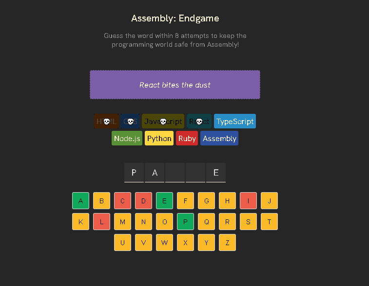
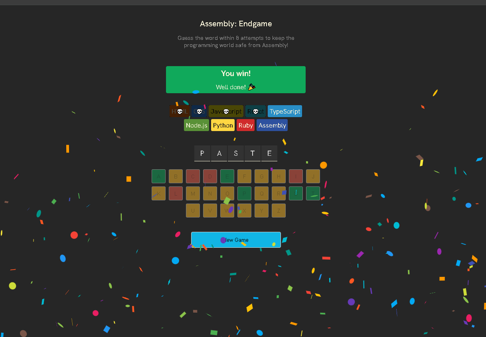
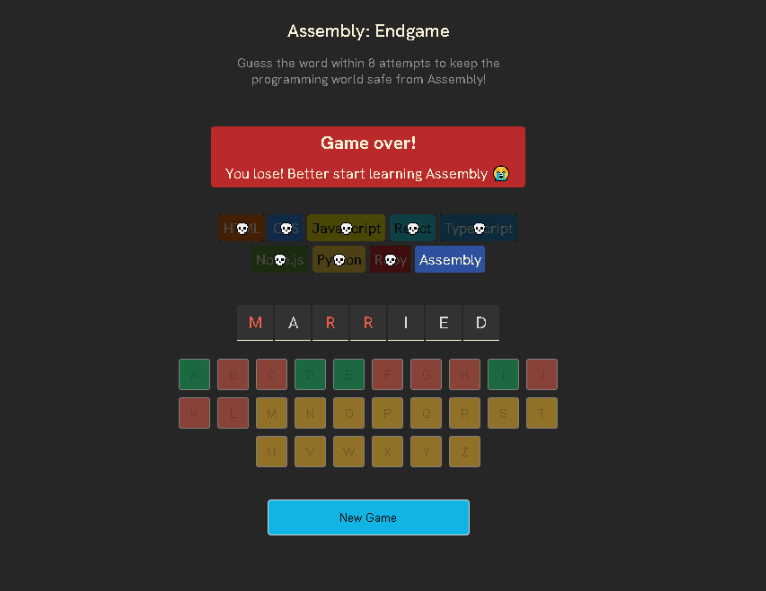

# 🕹️ Assembly: Endgame

**Assembly: Endgame** is a programming-themed word guessing game inspired by *Hangman*.  
The goal: guess the hidden programming-related word within 8 attempts to "save" the dev world from Assembly.  

Built as a **React + Vite project** to practice **state management, component design, event handling, conditional rendering, and CSS animations.**  

---

## 🚀 Features
- 🎮 **Game Logic**
  - Guess letters with a virtual keyboard  
  - Tracks correct vs. incorrect guesses  
  - 8 chances before "Assembly wins"  

- 🎉 **Win & Loss Screens**
  - Confetti animation on victory  
  - Fun "Game Over" message on loss  

- 🖼️ **Visual Feedback**
  - Green, yellow, and red highlights for guessed letters  
  - Icons representing programming languages as lives  

- 🧩 **Word List**
  - Powered by `words.js` — programming-related terms  
  - Random word chosen each round  

---

## 🖥️ Screenshots
- Gameplay  
  

- Win screen  
  

- Loss screen  
  

---

## 🛠️ Tech Stack
- **React** (with Vite) → fast dev environment + component architecture  
- **JavaScript (ES6+)** → state & game logic  
- **CSS** → styling, conditional colors, layout, confetti animations  
- **Node.js + npm** → package management  

---

## 📚 What I Practiced / Learned
- 🏗️ **React fundamentals**  
  - `useState` for game state (letters, attempts, win/loss)  
  - `useEffect` for game resets and effects  
  - Component composition (`App.jsx`, `utils.js`, `languages.js`)  

- 🎨 **UI/UX**  
  - Dynamic rendering of keyboard buttons and feedback colors  
  - Smooth confetti effect on victory  
  - Clean dark-themed design for modern look  

- 🧮 **Game logic**  
  - Word validation  
  - Attempt tracking & win/loss conditions  
  - Dynamic updates with each guess  

- 📂 **Project workflow**  
  - Organized components (`App`, `words.js`, `utils.js`)  
  - Practiced version control with Git + GitHub  
  - Deployed via static hosting (Netlify / Vercel compatible)  

---

## ⚡ Setup
1. Clone repo:
   ```bash
   git clone https://github.com/your-username/assembly-endgame.git
   cd assembly-endgame
   ```

2. Install dependencies:
   ```bash
   npm install
   ```

3. Run dev server:
   ```bash
   npm run dev
   ```

4. Open in browser:
   ```
   http://localhost:5173
   ```

---

## 🎯 Why This Project?
This was built as a **learning project** to:  
- Strengthen React fundamentals (state, events, components).  
- Practice **game logic implementation** in a real app.  
- Improve **UI/UX design** with feedback and animations.  
- Gain confidence with **Vite + React project setup**.  

---

## 📄 License
MIT License — free to use and adapt.  
